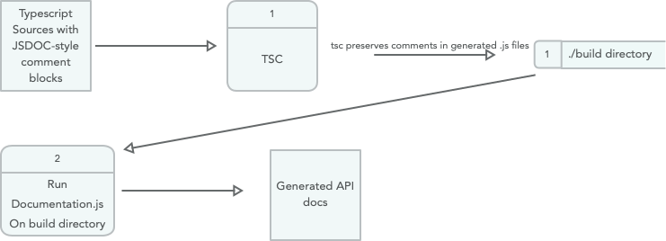

# ts-clear-classdoc

A toolchain utility for removing JSDoc `\* @Class *\ ` stubs from js files output by the typescript compiler (tsc) prior to doc generation.

[![Build Status][build-status]][build-url]
[![NPM version][npm-image]][npm-url]
[![Downloads][downloads-image]][npm-url]
[![TotalDownloads][total-downloads-image]][npm-url]
[![Twitter Follow][twitter-image]][twitter-url]

[build-status]:https://travis-ci.org/tremho/ts-clear-classdoc.svg?branch=develop
[build-url]:https://travis-ci.org/tremho/ts-clear-classdoc
[npm-image]:http://img.shields.io/npm/v/ts-clear-classdoc.svg
[npm-url]:https://npmjs.org/package/ts-clear-classdoc
[downloads-image]:http://img.shields.io/npm/dm/ts-clear-classdoc.svg
[total-downloads-image]:http://img.shields.io/npm/dt/ts-clear-classdoc.svg?label=total%20downloads
[twitter-image]:https://img.shields.io/twitter/follow/Tremho1.svg?style=social&label=Follow%20me
[twitter-url]:https://twitter.com/Tremho1

##### How I roll
This possibly esoteric tool is useful in my chosen build-and-documentation
toolchain, which looks like this:



In general, this works out well.  I like to use
the JSDoc format, and have other tools that help me
manage this as a doc format.  However, I've become
disenchanted with JSDOC itself and its inconsistencies.
So I've started using [documentation.js](http://documentation.js.org)
which is a much more consistent tool and allows output
directly into markdown, which I appreciate.

Documentation.js [does not allow doc generation from
typescript source files directly](https://github.com/documentationjs/documentation/issues/282)
which is unfortunate, but a workaround is to just use the
generated .js files output from the typescript compiler (tsc).

This mostly works, and captures the comment blocks for most
items as expected.  Properties declared on a class will not get comments
transferred, unless they are referred to in the constructor;
interfaces and types do not transfer documentation blocks to the rendered
javascript either.  One must use more explicit (and sadly redundant) means
to force these types of documentation to be represented. 

So, it's not a perfect solution, but it's one that works.
But there is still a minor remaining flaw:  For whatever reason that
I'm sure made sense to somebody at some time, a class declared in 
typescript gets rendered something like this in the javascript:

```
/**
 * Documentation block copied over from source
 */
var MyClass = /* @class */ (function () {
    function MyClass() {
    }
    return MyClass;
}());

```
which is all well and good, except that `/* @class */ `
comment will create a *second* `MyClass` doc entry with no
content, in addition to the one containing the imported doc block.

Pedantic, perhaps.  But I don't want my docs littered up with
these secondary phantom stubs.

So this utility simply strips those comment stubs out of
the .js file (which doesn't affect its execution in any way,
of course).

This is run just prior to the invocation of the documentation.js doc
generation as part of a build script sequence, so in the
end all turns out as it should.

If this is a documenation workflow for typescript that 
you think will work for you, you may find this utility
helpful.  

### Usage

1. Install via npm:
    npm install --save-dev ts-clear-classdoc
    
2. Use in a build script with the command `tsccd`
as in: `tsccd ./build` (pointing it at the output folder
where tsc has generated the .js files)

----------
  
## Source code and Contributing

Not sure what could be contributed, but feel free to fork the repository
and push pull requests for any ideas you have.  It would
be much appreciated.

The source for this package is maintained on GitHub at:
https://github.com/tremho/ts-clear-classdoc

Or, feel free to email me at `steve@ohmert.com` to start
a discussion for other suggestions.
 

  